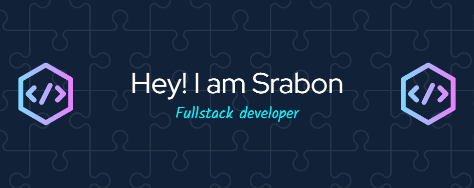

<h1 align="center">Hi 👋, I'm Srabon Barua</h1>
<h3 align="center">🚀 Backend Developer | AWS DevOps Engineer | 2+ Years Experience</h3>

---

### 👨‍💻 About Me

- 🔧 Backend Developer with **2+ years of experience at m360ict**
- 🎨 1 year experience working with **frontend technologies**
- ☁️ Hands-on with **AWS & DevOps workflows**
- ⚡ Focused on **scalable systems, APIs & performance optimization**
- 🌱 Currently learning **Kubernetes, Microservices Architecture**
- 💬 Ask me about **Node.js, Python, Databases, System Design, DevOps**
- 📫 Reach me: **et.srabon@gmail.com**

---

### 🚀 Current Role

- 💼 Backend Developer at **m360ict**
- 🔹 Designing and maintaining scalable backend services  
- 🔹 Managing cloud infrastructure (AWS)  
- 🔹 Improving CI/CD and deployment pipelines  

---

### 🌐 Portfolio & Resume

- 🌍 Portfolio: https://srabon-portfolio.netlify.app
- 📄 Resume: https://drive.google.com/file/d/1iMWpsHb9WTSguKNliSLZCkHeqOiKGm-P/view  

---

### 🤝 Connect with Me

---

### 🛠️ Tech Stack

#### 💻 Backend
- Node.js, Express.js  
- Python (Scripting, Automation, Backend Basics)  
- REST API Development  
- Authentication & Security  

#### 🗄️ Databases & Caching
- MongoDB  
- PostgreSQL  
- MySQL  
- Microsoft SQL Server (MSSQL)  
- Redis (Caching, Performance Optimization)  

#### ☁️ Cloud & DevOps
- AWS (EC2, S3, Lambda, IAM)  
- CI/CD Pipelines  
- Docker  
- Kubernetes (Basic)  
- Nginx & Server Management  

#### 🧠 Architecture & Practices
- MVC Pattern  
- RESTful Design  
- Basic Microservices  
- API Optimization & Scaling  

#### 🎨 Frontend (1 Year Experience)
- React.js  
- Next.js  
- Tailwind CSS  

---

### 📊 GitHub Stats

  

---

### ⚡ Fun Fact

> I enjoy building **scalable backend systems**, optimizing performance, and automating workflows with **Python & DevOps tools** 🚀
